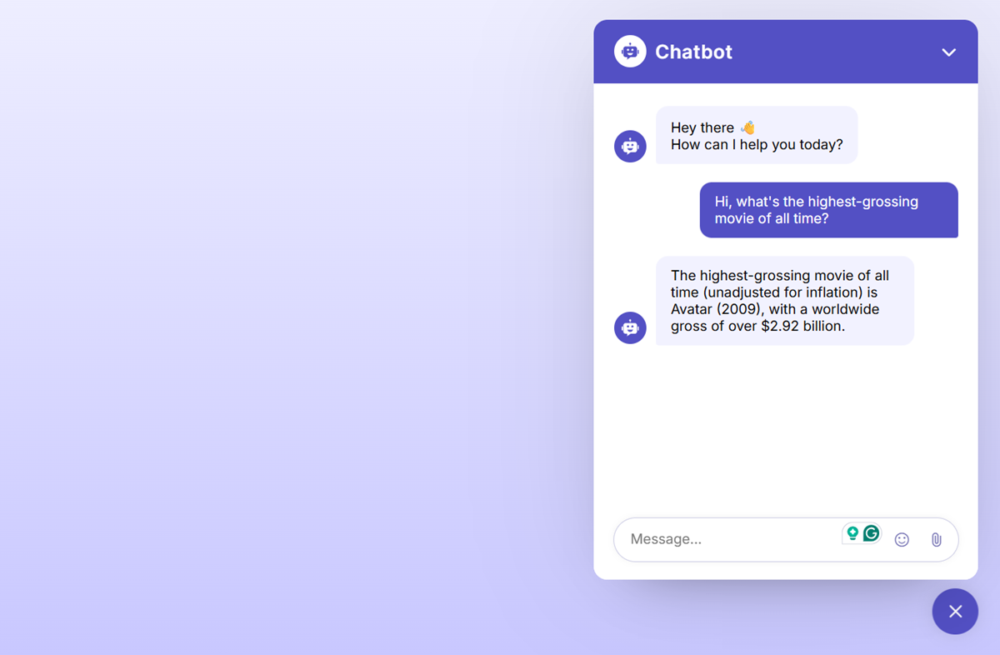

# Ai Chatbot

## Content

This is an AI chatbot. I created it by following an excellent tutorial on Youtube by [CodingNepal](https://youtu.be/B21G6tUI4L0?si=q87ypp5ix8aH8ofl). I followed the tutorial because I wanted to get practice linking to open ai type tools.

It's my intention to update it and improve it substantially myself in the future when I get a chance. It's great as it is but I want to put my own stamp on it using my own coding skills and knowledge rather than just following along with a video.
